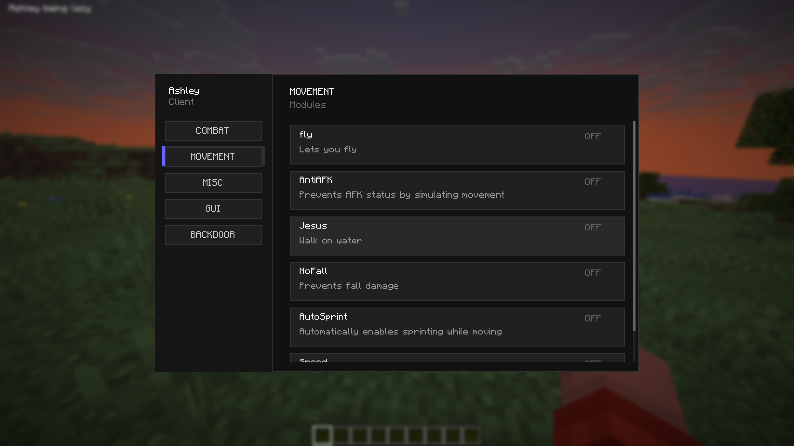

# AshleyClient
a multi-purpose client 

Features

- Allows Access to Mojang blocked servers
- Disables Mojang Telemetry 

Modules

**Combat**
- Anchor Spam
- Auto Totem

**GUI**
- ArrayList
- Fps

**MISC**
- AutoRespawnn
- ClientBrand
- IgnoreResourcePack
- SpamPackets

**MOVEMENT**
- AntiAFK
- AutoSprint
- Fly
- Jesus
- NoFall
- Speed
- ClickTP

